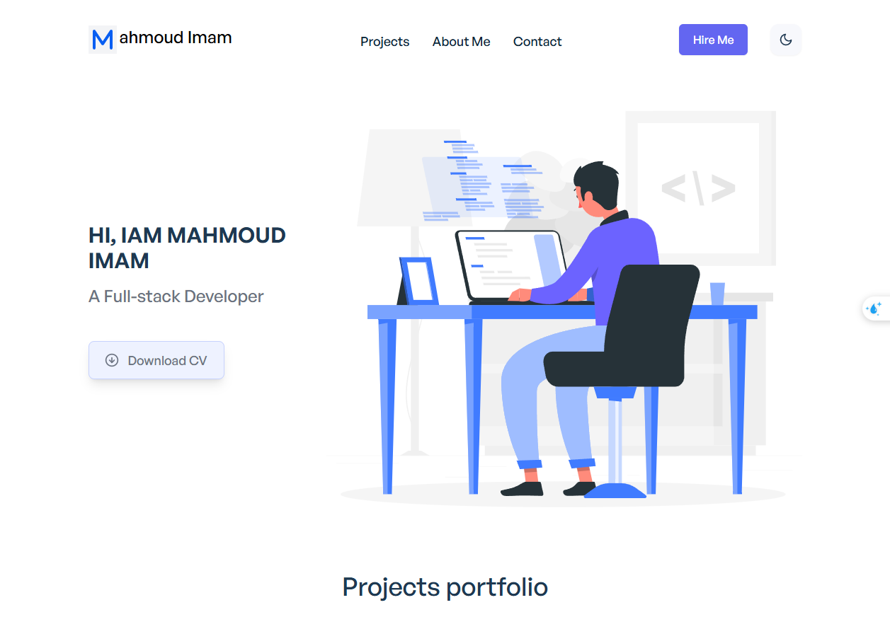
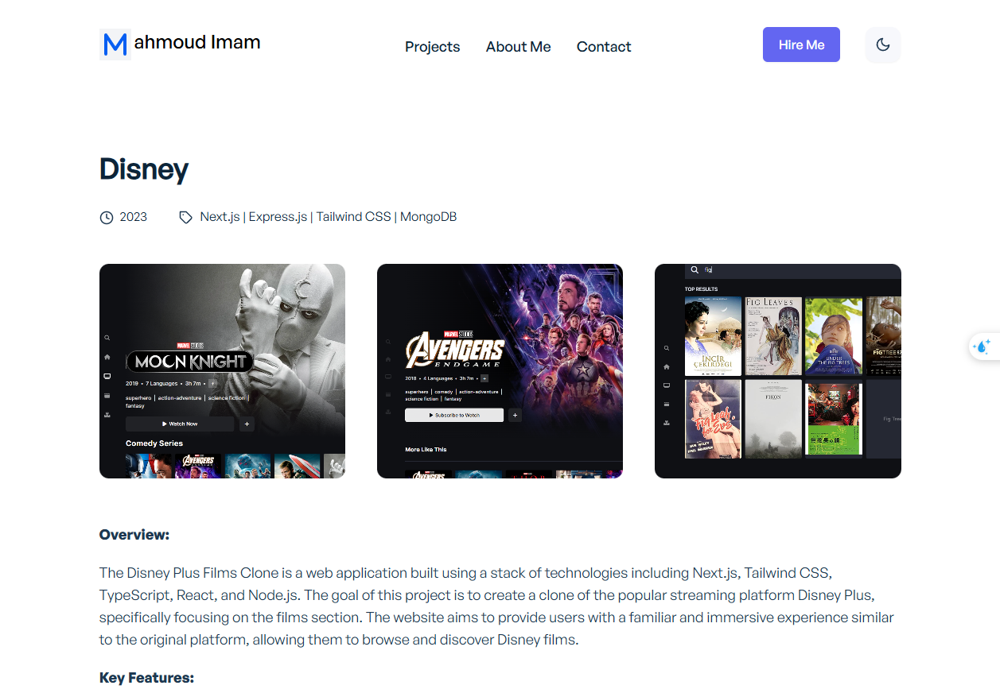
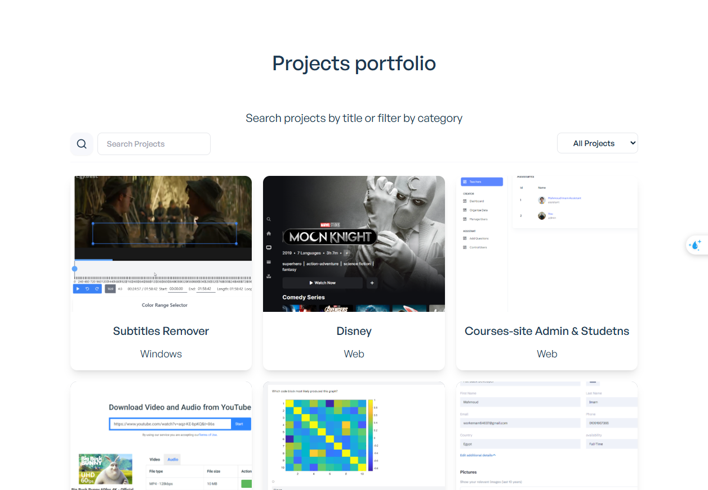

# Portfolio

Welcome to my personal portfolio! 🚀




## Overview

This portfolio is a showcase of my work, skills, and projects. It is built using **Next.js** and **Tailwind CSS**, ensuring a modern, fast, and responsive experience.

## Features

- Dynamic content fetched from an external API.
- Fully customizable for other users.
- Built with performance and SEO in mind.
- Exported as a static site using **Next.js**, making it always available to users without requiring server requests.

## API Integration

This portfolio is powered by my own API service, which allows dynamic updates and customization. The API is hosted at:
👉 [CV Builder API](https://cv-builder-tobe.onrender.com/)

This API enables users to personalize their portfolio by supplying custom data, making it a versatile solution for developers who want to showcase their work dynamically.

## Tech Stack

- **Next.js** – For a seamless React-based framework and static export.
- **Tailwind CSS** – For a beautiful, responsive design with minimal effort.
- **Custom API** – Provides dynamic content for flexibility and customization.

## How to Use

1. Clone the repository:
   ```sh
   git clone https://github.com/your-username/your-portfolio.git
   ```
2. Install dependencies:
   ```sh
   cd your-portfolio
   npm install
   ```
3. Run the development server:
   ```sh
   npm run dev
   ```
4. Customize your data by integrating with the [CV Builder API](https://cv-builder-tobe.onrender.com/).

## Contributing

If you have suggestions for improvements, feel free to submit a pull request or open an issue!

## License

This project is open-source and available under the MIT License.

---

⭐ Don't forget to star the repository if you find it useful!
